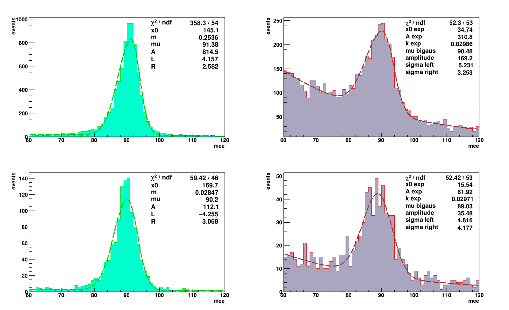
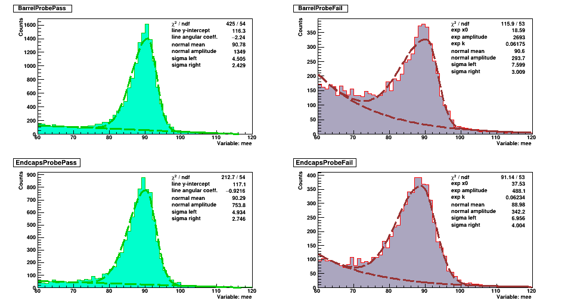
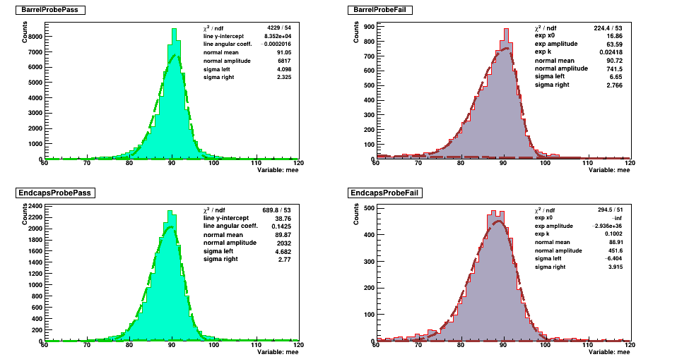
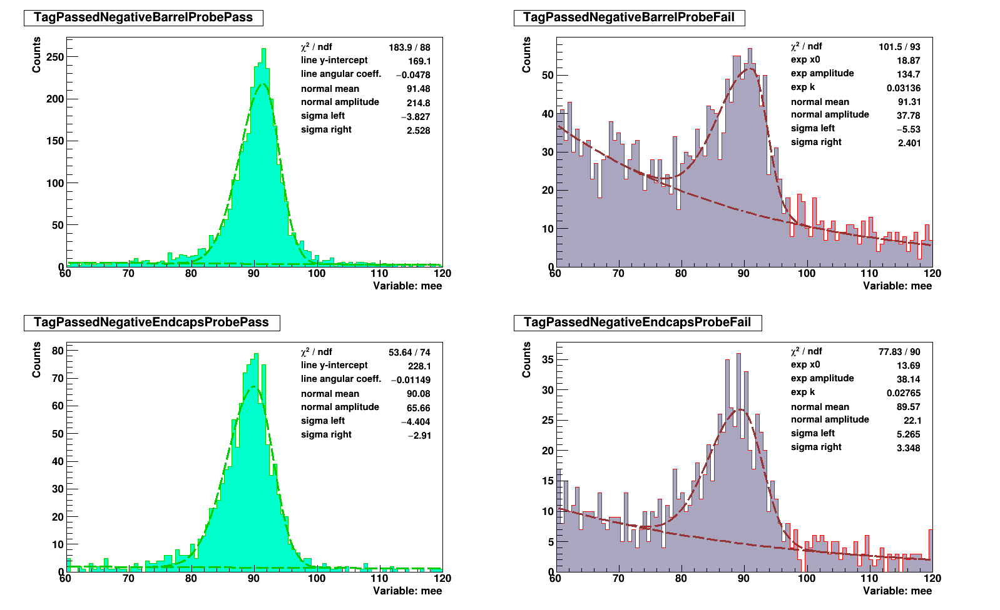

# Tirocinio 


## Bug fixed:
- There was a problem in `analisi.C` where the barrel and endcaps positions where not tested with `abs()` function. This resulted in more events beeing passed in the barrel than the ones in the funciton `filters::GoodWP80(int)`.

# (not so) Quickstart
1. Load the data in the filters. This makes the variables used by analisi accessible to the filter functions:
```
filters::loadData(this)
```
2. Create a filter inside filters.h (or .cpp) with this prototype or use one of the existing ones:
```
Boolt_t filters::myfilter(void)
```
3. Create a binaryTree to store the data and apply filters:
```
FilterTree mytree("root");
```
4. Create a branch with options "gd" to `graph` and `draw`:
```
mytree.root->branch("branchName", filters::myfilter, fitLeftPrototype, fitRightPrototype, "gd");
```
5. create a canvas to draw stuff:
```
auto canvas = new TCanvas("mycanvas", "mycanvas", 0, 0, 800, 600);
mytree.root->setPad(canvas);
```
6. Filter data in the loop:
```
mytree.root->fill(mee);
```
An example of a minimal working code is the following:
```
#define analisi_cxx
#include "src/global.h"
#include "src/filters.h"
#include "src/fitFunctions.h"
#include "src/SmartGraph.h"
#include "src/BinaryFilter.h"

#include <TCanvas.h>
#include <TH1F.h>
#include <TH2.h>
#include <TSystem.h>
#include <TF1.h>
#include <fstream>

void analisi::Loop()
{
    // load data into the filters
    filters::loadData(this);

    // create canvas and SmartGraphs
    auto canvas = new TCanvas("mycanvas", "mycanvas", 0, 0, 800, 600);
    FilterTree unfiltered("");

    auto tagGood = unfiltered.root->require("isTagGood", filters::isTagGood, "g");
    tagGood->branch("barrel", "endcaps", filters::isBarrel, filters::isEndcaps, "g");
    tagGood->left->branch("probe", filters::isProbeGood, rettaBigausPrototype, expBigausPrototype, "gd");
    tagGood->right->branch("probe", filters::isProbeGood, rettaBigausPrototype, expBigausPrototype, "gd");

    // generate pads for tagGood
    tagGood->setPad(canvas);


    // style
    setGlobalStyle();
    // health check
    if (fChain == 0)
        return;

    // variable definitions
    Long64_t nentries = fChain->GetEntriesFast();
    Long64_t nbytes = 0, nb = 0;

    for (Long64_t jentry = 0; jentry < nentries; jentry++)
    {
        Long64_t ientry = LoadTree(jentry);
        if (ientry < 0)
            break;
        nb = fChain->GetEntry(jentry);
        nbytes += nb;

        unfiltered.root->Fill(mee);
    }

    tagGood->FitAndDraw();
    printHeader("Fit results");
    unfiltered.printTree(unfiltered.root);
```


# Some data
## Initial analysis

All the events, filtered for probe in barrel/endcaps. 
## PT < 25 [see the data](ptBin0.md)

## 25 < PT < 33  [see the data](ptBin1.md)

## 33 < PT < 41 [see the data](ptBin2.md)

## PT > 41 [see the data](ptBin3.md)


## Todo
- The pad  


## Contributing

Contributions are welcome. Please open an issue to discuss your ideas before making a change.

